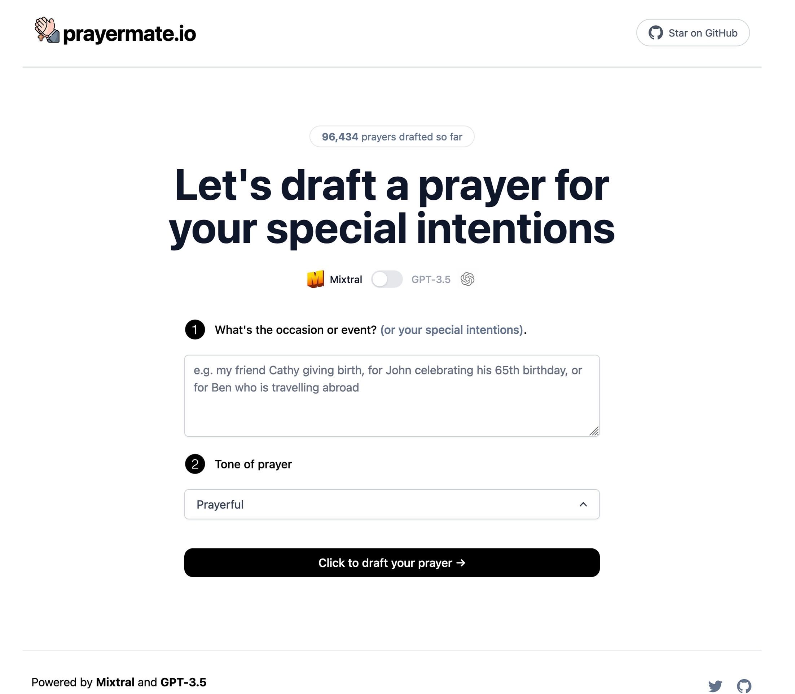

# Catholic Prayer AI Assistant

This AI Assistant helps you draft a Catholic prayer for your special intentions.

## Cloned from twitterbio.io

[twitterbio.io](https://www.twitterbio.io/)

## How it works

This project uses both [Mixtral](https://mistral.ai/news/mixtral-of-experts/) and [GPT-3.5](https://openai.com/api/) with streaming to generate a Twitter bio. It constructs a prompt based on the form and user input, sends it either to the Mixtral API through [Together.ai](https://www.together.ai/) or the GPT-3.5 API through OpenAI, then streams the response back to the application.

If you'd like to see how I built the GPT-3.5 version of this, check out the [video](https://youtu.be/JcE-1xzQTE0) or [blog post](https://vercel.com/blog/gpt-3-app-next-js-vercel-edge-functions).

## Running Locally

1. Create an account at [OpenAI](https://beta.openai.com/account/api-keys) and add your API key under `OPENAI_API_KEY` in your `.env`
2. Create an account at [Together.ai](https://www.together.ai/) and add your API key under `TOGETHER_API_KEY`
3. Run the application with `npm run dev` and it will be available at `http://localhost:3000`.
